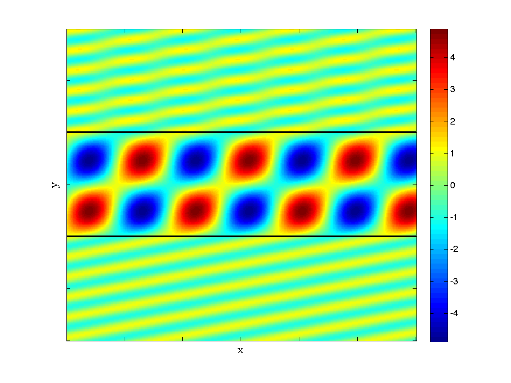

Dependencies
------------
- [MPSpack](http://code.google.com/p/mpspack/)

Usage
---------
The optim directory contains code to optimize a solar cell for maximum absorbance.
`totalSpectralAbsorbance` calculates absorbance across the spectrum.
`totalSpectralAbsorbance(3,false,3,[1,.7,.15],[1.5,2,3,1])` calculates the absorbance
of a three-layer waveguide without a mirror backing where the third layer is the active
layer. Layer one is 1 micron thick, layer two .7 microns thick, and layer three .15
microns. Layer one has refractive index 1.5, layer two 2, layer three 3, and the final,
infinite layer 1, corresponding to freespace. Since layer three is the active layer its
refractive index will be replaced by the actual refractive index of silicon at the
given wavelength.

The viz directory contains two GUIs designed to explore the resonances of waveguides
across angle and frequency of incident light, and to show how waves travel through
the waveguides. The entry points are `threelayergui` and `mirrorgui`.
Try `threelayergui('te',3.5,1,3.5,1,0,10,0,10)` and click on the bright lines in
the upper half to see light waves moving through the waveguide, just like this:
