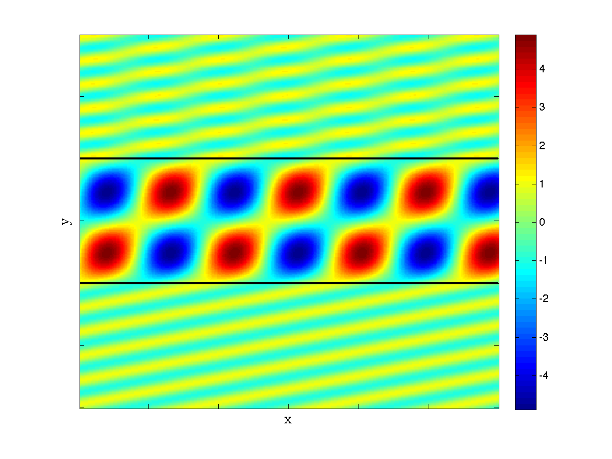

Dependencies
------------
- [MPSpack](http://code.google.com/p/mpspack/)

Structure
---------
The optim directory contains code to optimize a solar cell for maximum absorbance.
`totalSpectralAbsorbance` calculates absorbance across the spectrum.

The viz directory contains a GUI designed to explore the resonances of a three-layer
waveguide across angle and frequency of incident light, and to explore how the waves
travel through the waveguide. `threelayergui` is the entry point to the application.
Try `threelayergui('te',3.5,1,3.5,1,0,10,0,10)` and click on the bright lines in
the upper half to see light waves moving through the waveguide, just like this:
